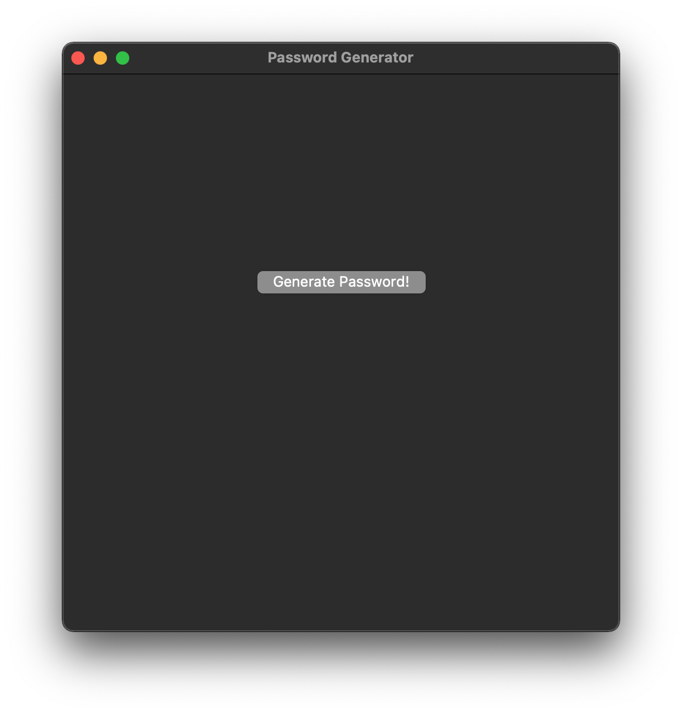
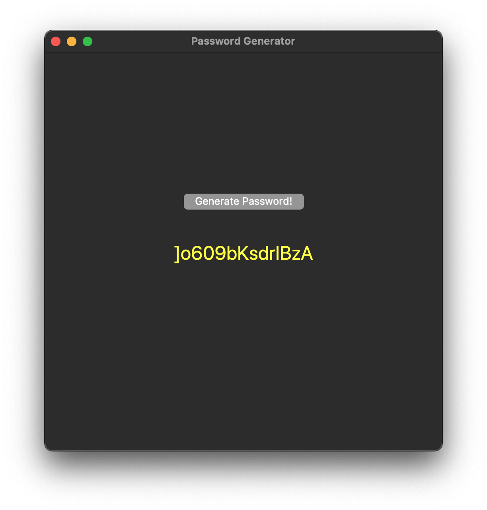

# Password-Generator
A simple program that generates a strong password for the user.

### How to run

Make sure you have Tkinter installed or install using:

```sh
pip install tk
```

Run the app using:
```sh
python3 main.py
```

### Example Usage

Click the "Generate Password!" button.



Password is automatically copied to your clipboard.


